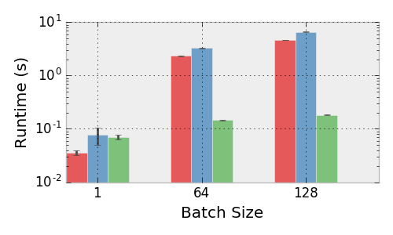

# qpth  [ ![Release] [release-image] ] [releases] [ ![License] [license-image] ] [license]

*A fast and differentiable QP solver for PyTorch.
Crafted by [Brandon Amos](http://bamos.github.io) and
[J. Zico Kolter](http://zicokolter.com).*

[release-image]: http://img.shields.io/badge/release-0.0.1-blue.svg?style=flat
[releases]: https://github.com/cmusatyalab/openface/releases

[license-image]: http://img.shields.io/badge/license-Apache--2-blue.svg?style=flat
[license]: LICENSE

# Optimization primitives are important for modern (deep) machine learning.

[Mathematical optimization](https://en.wikipedia.org/wiki/Mathematical_optimization)
is a well-studied language of expressing solutions to many real-life problems
that come up in machine learning and many other fields such as mechanics,
economics, EE, operations research, control engineering, geophysics,
and molecular modeling.
As we build our machine learning systems to interact with real
data from these fields, we often **cannot** (but sometimes can)
simply ``learn away'' the optimization sub-problems by adding more
layers in our network. Well-defined optimization problems may be added
if you have a thorough understanding of your feature space, but
oftentimes we **don't** have this understanding and resort to
automatic feature learning for our tasks.

Until this repository, **no** modern deep learning library has provided
a way of adding a learnable optimization layer (other than simply unrolling
an optimization procedure, which is inefficient and inexact) into
our model formulation that we can quickly try to see if it's a nice way
of expressing our data.

See our paper
[OptNet: Differentiable Optimization as a Layer in Neural Networks](todo)
and code at
[locuslab/optnet](https://github.com/locuslab/optnet)
if you are interested in learning more about our initial exploration
in this space of automatically learning quadratic program layers
for signal denoising and sudoku.

# What is a quadratic program (QP) layer?

[Wikipedia gives a great introduction to quadratic programming](https://en.wikipedia.org/wiki/Quadratic_programming).

We define a quadratic program layer as

\begin{equation*}
\begin{split}
z_{i+1} = {\rm argmin}_{z} \;\; & \frac{1} {2}z^T Q(z_i) z + p(z_i)^T z \\
{\rm subject\; to} \;\; & A(z_i) z  = b(z_i) \\
& G(z_i) z \leq h(z_i)
\end{split}
\end{equation*}
where $z_{i+1}\in\mathbb{R}^n$ is the current layer,
$z_i\in\mathbb{R}^n$ is the previous layer,
$z\in\mathbb{R}^n$ is the optimization variable,
and
$Q(z_i)\in\mathbb{R}^{n\times n}$,
$p(z_i)\in\mathbb{R}^n$,
$A(z_i)\in\mathbb{R}^{m\times n}$,
$b(z_i)\in\mathbb{R}^m$,
$G(z_i)\in\mathbb{R}^{p\times n}$, and
$h(z_i)\in\mathbb{R}^p$ are parameters of
the optimization problem.
As the notation suggests, these parameters can depend in any differentiable way
on the previous layer $z_i$, and which can be optimized just like
any other weights in a neural network.
For simplicity, we often drop the explicit dependence on
$z_i$ from the parameters.

# What does this library provide?

This library provides a fast, batched, and differentiable
QP layer as a PyTorch Function.

# How fast is this compared to Gurobi?



*Performance of the Gurobi (red), qpth single (ours, blue),
qpth batched (ours, green) solvers.*

We run our solver on an unloaded Titan X GPU and Gurobi on an
unloaded quad-core Intel Core i7-5960X CPU @ 3.00GHz.
We set up the same random QP across all three frameworks and vary the number of
variable, constraints, and batch size.

*Experimental details:* we sample
entries of a matrix $U$ from a random uniform distribution and set $Q = U^TU +
10^{-3}I$, sample $G$ with random normal entries, and set $h$ by
selecting generating some $z_0$ random normal and $s_0$ random uniform and
setting $h = Gz_0 + s_0$ (we didn't include equality constraints just for
simplicity, and since the number of inequality constraints in the primary
driver of complexity for the iterations in a primal-dual interior point
method. The choice of $h$ guarantees the problem is feasible.

The figure above shows the means and standard deviations
of running each trial 10 times, showing that our solver
outperforms Gurobi, itself a highly tuned solver, in all batched instances.
For the minibatch size of 128, we solve all problems in an average of 0.18
seconds, whereas Gurobi tasks an average of 4.7 seconds.  In the context of
training a deep architecture this type of speed difference for a single
minibatch can make the difference between a practical and a completely unusable
solution.

# Setup and Dependencies

+ Python/numpy
+ [PyTorch](https://pytorch.org)
  + The code currently requires a source install from the master branch from
    [our fork](https://github.com/locuslab/pytorch) for new batch triangular
    factorization functions we have added.
    We are currently working with the PyTorch team to get these new features
    merged into Torch proper.
+ [bamos/block](https://github.com/bamos/block):
  *Our intelligent block matrix library for numpy, PyTorch, and beyond.*

# Usage

You can see many full working examples in our
[locuslab/optnet](https://github.com/locuslab/optnet)
repo.

Here's an example that adds a small QP layer with
only inequality constraints at the end of a
fully-connected network.
This layer has $Q=LL^T+\epsilon I$ where $L$
is a lower-triangular matrix and $h=G z_0 + s_0$
for some learnable $z_0$ and $s_0$ to ensure the
problem is always feasible.

```
from qpth.qp import QPFunction

...

class OptNet(nn.Module):
    def __init__(self, nFeatures, nHidden, nCls, bn, nineq=200, neq=0, eps=1e-4):
        super().__init__()

        self.nFeatures = nFeatures
        self.nHidden = nHidden
        self.bn = bn
        self.nCls = nCls
        self.nineq = nineq
        self.neq = neq
        self.eps = eps

        if bn:
            self.bn1 = nn.BatchNorm1d(nHidden)
            self.bn2 = nn.BatchNorm1d(nCls)

        self.fc1 = nn.Linear(nFeatures, nHidden)
        self.fc2 = nn.Linear(nHidden, nCls)

        self.M = Variable(torch.tril(torch.ones(nCls, nCls)).cuda())
        self.L = Parameter(torch.tril(torch.rand(nCls, nCls).cuda()))
        self.G = Parameter(torch.Tensor(nineq,nCls).uniform_(-1,1).cuda())
        self.z0 = Parameter(torch.zeros(nCls).cuda())
        self.s0 = Parameter(torch.ones(nineq).cuda())

    def forward(self, x):
        nBatch = x.size(0)

        # FC-ReLU-(BN)-FC-ReLU-(BN)-QP-Softmax
        x = x.view(nBatch, -1)
        x = F.relu(self.fc1(x))
        if self.bn:
            x = self.bn1(x)
        x = F.relu(self.fc2(x))
        if self.bn:
            x = self.bn2(x)

        L = self.M*self.L
        Q = L.mm(L.t()) + self.eps*Variable(torch.eye(self.nCls)).cuda()
        h = self.z0.mm(self.G.t())+self.s0
        e = Variable(torch.Tensor())
        x = QPFunction(verbose=False)(x, Q, G, h, e, e)

        return F.log_softmax(x)
```

# Caveats

+ Make sure that your QP layer is always feasible.
  Otherwise it will become ill-defined.
  One way to do this is by selecting some $z_0$ and $s_0$
  and then setting $h=Gz_0+s_0$ and $b=Az_0$.
+ If your convergence seems instable, the solver may
  not be exactly solving them. Oftentimes, using doubles
  instead of floats will help the solver better approximate
  the solution.
+ See the ``Limitation of the method'' portion of our paper
  for some more notes.

# Acknowledgments

+ The rapid development of this work would not have been possible without
  the immense amount of help from the [PyTorch](https://pytorch.org) team,
  particularly [Soumith Chintala](http://soumith.ch/) and
  [Adam Paszke](https://github.com/apaszke).
+ The inline LaTeX in this README was created with
  [leegao/readme2tex](https://github.com/leegao/readme2tex)
  with [this script](https://github.com/locuslab/qpth/blob/master/make-readme.sh)
  in our repo.

# Citations

If you find this repository helpful in your publications,
please consider citing our paper.

```
@article{amos2017optnet,
  title={OptNet: Differentiable Optimization as a Layer in Neural Networks},
  author={Brandon Amos and J. Zico Kolter},
  journal={arXiv preprint arXiv:TODO},
  year={2017}
}
```

# Licensing

Unless otherwise stated, the source code is copyright
Carnegie Mellon University and licensed under the
[Apache 2.0 License](./LICENSE).

---

# Appendix

These sections are copied here from our paper for convenience.
See the paper for full references.

## How the forward pass works.

Deep networks are typically trained in mini-batches to take advantage
of efficient data-parallel GPU operations.
Without mini-batching on the GPU, many modern deep learning
architectures become intractable for all practical purposes.
However, today's state-of-the-art QP solvers like Gurobi and CPLEX
do not have the capability of solving multiple optimization
problems on the GPU in parallel across the entire minibatch.
This makes larger OptNet layers become quickly intractable
compared to a fully-connected layer with the same number of parameters.

To overcome this performance bottleneck in our quadratic program layers,
we have implemented a GPU-based primal-dual interior point
method (PDIPM) based on [mattingley2012cvxgen]
that solves a batch of quadratic programs, and which provides the necessary
gradients needed to train these in an end-to-end fashion.

Following the method of [mattingley2012cvxgen],
our solver introduces slack variables on the inequality constraints
and iteratively minimizes the residuals from the KKT conditions
over the primal and dual variables.
Each iteration computes the affine scaling directions by solving
\begin{equation*}
  K
  \begin{bmatrix}
    \Delta z^{\rm aff} \\
    \Delta s^{\rm aff} \\
    \Delta \lambda^{\rm aff} \\
    \Delta \nu^{\rm aff} \\
  \end{bmatrix}
  =
  \begin{bmatrix}
    -(A^T\nu + G^T\lambda + Qz + p) \\
    -S\lambda \\
    -(Gz+s-h) \\
    -(Az-b) \\
  \end{bmatrix}
  \label{eq:cvxgen:affine}
\end{equation*}
where
\begin{equation*}
  K =
  \begin{bmatrix}
    Q & 0 & G^T & A^T \\
    0 & D(\lambda) & D(s) & 0 \\
    G & I & 0 & 0 \\
    A & 0 & 0 & 0 \\
  \end{bmatrix},
\end{equation*}
then centering-plus-corrector directions by solving
\begin{equation*}
  K
  \begin{bmatrix}
    \Delta z^{\rm cc} \\
    \Delta s^{\rm cc} \\
    \Delta \lambda^{\rm cc} \\
    \Delta \nu^{\rm cc} \\
  \end{bmatrix}
  =
  \begin{bmatrix}
    0 \\
    \sigma\mu 1 - D(\Delta s^{\rm aff}) \Delta \lambda^{\rm aff} \\
    0 \\
    0 \\
  \end{bmatrix},
\end{equation*}
where $\mu$ is the duality gap and $\sigma>0$.
Each variable $v$ is updated with
$\Delta v = \Delta v^{\rm  aff} + \Delta v^{\rm cc}$
using an appropriate step size.

We solve these iterations for every example in our
minibatch by solving a symmetrized version
of these linear systems with
\begin{equation*}
    K_{\rm sym}=
  \begin{bmatrix}
    Q & 0 & G^T & A^T \\
    0 & D(\lambda/s) & I & 0 \\
    G & I & 0 & 0 \\
    A & 0 & 0 & 0 \\
  \end{bmatrix},
\end{equation*}
where
$D(\lambda/s)$ is the only portion of $K_{\rm sym}$
that changes between iterations.
We analytically decompose these systems into smaller
symmetric systems and pre-factorize portions of them
that don't change (i.e. that don't involve $D(\lambda/s)$
between iterations.

## QP layers and backpropagation

Training deep architectures, however, requires that we not just have a forward
pass in our network but also a backward pass. This requires that we compute the
derivative of the solution to the QP with respect to its input parameters.
Although the previous papers mentioned above have considered similar argmin
differentiation techniques [gould2016differentiating], to the best of
our knowledge this is the
first case of a general formulation for argmin differentiation in the presence
of exact equality and inequality constraints.  To obtain these derivatives, we
we differentiate the KKT conditions (sufficient and necessary condition for
optimality) of a QP at a solution to the problem,  using techniques
from matrix differential calculus [magnus1988matrix].
Our analysis here can be extended to
more general convex optimization problems.

The Lagrangian of a QP is given by
\begin{equation*}
L(z,\nu,\lambda)=\frac{1}{2}z^TQz+p^Tz+\nu^T(Az-b)+\lambda^T(Gz-h)
\end{equation*}
where $\nu$ are the dual variables on the equality constraints
and $\lambda\geq 0$ are the dual variables on the inequality constraints.
The KKT conditions for stationarity, primal feasibility,
and complementary slackness are
\begin{equation*}
\begin{split}
Qz^\star+p+A^T\nu^\star+G^T\lambda^\star &= 0 \\
Az^\star-b &= 0 \\
D(\lambda^\star)(Gz^\star-h) &= 0,
\end{split}
\end{equation*}
where $D(\cdot)$ creates a diagonal matrix from a vector. Taking the
differentials of these conditions gives the equations
\begin{equation*}
\begin{split}
\mathsf{d} Qz^\star + Q \mathsf{d} z + \mathsf{d} p + \mathsf{d} A^T \nu^\star + & \\
A^T \mathsf{d} \nu + \mathsf{d} G^T
\lambda^\star + G^T \mathsf{d} \lambda & = 0 \\
\mathsf{d} A z^\star + A \mathsf{d} z - \mathsf{d} b & = 0 \\
D(Gz^\star -h)\mathsf{d} \lambda + D(\lambda^\star)(\mathsf{d} G z^\star  + G \mathsf{d} z  - \mathsf{d} h)
& = 0
\end{split}
\end{equation*}
or written more compactly in matrix form
\begin{equation*}
  \begin{split}
\begin{bmatrix}
Q & G^T & A^T \\
D(\lambda^\star)G  & D(Gz^\star-h) & 0 \\
A & 0 & 0 \\
\end{bmatrix}
\begin{bmatrix}
\mathsf{d} z \\
\mathsf{d} \lambda \\
\mathsf{d} \nu \\
\end{bmatrix} = \\
\begin{bmatrix}
-\mathsf{d} Qz^\star - \mathsf{d} p - \mathsf{d} G^T\lambda^\star - \mathsf{d} A^T\nu^\star \\
-D(\lambda^\star)\mathsf{d} Gz^\star + D(\lambda^\star)\mathsf{d} h \\
-\mathsf{d} Az^\star + \mathsf{d} b \\
\end{bmatrix}.
  \end{split}
  \label{eq:kkt-diff}
\end{equation*}
Using these equations, we can form the Jacobians of $z^\star$ (or
$\lambda^\star$ and $\nu^\star$, though we don't consider this case here), with
respect to any of the data parameters.  For example, if we wished to compute the
Jacobian $\frac{\partial z^\star}{\partial b} \in \mathbb{R}^{n \times m}$, we
would simply substitute $\mathsf{d} b = I$ (and set all other differential terms in
the right hand side to zero), solve the equation, and the resulting value of
$\mathsf{d} z$ would be the desired Jacobian.

In the backpropagation algorithm, however, we never want to explicitly form the
actual Jacobian matrices, but rather want to form the left matrix-vector product
with some previous backward pass vector $\frac{\partial \ell}{\partial z^\star}
\in \mathbb{R}^n$, i.e., $\frac{\partial \ell}{\partial z^\star} \frac {\partial
z^\star}{\partial b}$.   We can do this efficiently by noting the
solution for the $(\mathsf{d} z, \mathsf{d} \lambda, \mathsf{d} \nu)$ involves multiplying the *inverse* of the left-hand-side matrix above by some right hand
side.  Thus, if multiply the backward pass vector by the transpose of the
differential matrix
\begin{equation*}
\label{eq-d-def}
\begin{bmatrix}
d_z \\ d_\lambda \\ d_\nu
\end{bmatrix}
=
\begin{bmatrix}
Q & G^T D(\lambda^\star) & A^T \\
G  & D(Gz^\star-h) & 0 \\
A & 0 & 0 \\
\end{bmatrix}^{-1}
\begin{bmatrix}
\left(\frac{\partial \ell}{\partial z^\star}\right)^T \\ 0 \\ 0
\end{bmatrix}
\end{equation*}
then the relevant gradients with respect to all the QP parameters can be given by
\begin{equation*}
  \begin{aligned}
    \frac{\partial \ell}{\partial p} &= d_z
    & \frac{\partial \ell}{\partial b} &= -d_\nu \\
    \frac{\partial \ell}{\partial p} &= d_z
    & \frac{\partial \ell}{\partial b} &= -d_\nu \\
    \frac{\partial \ell}{\partial h} &= -D(\lambda^\star) d_\lambda
    & \frac{\partial \ell}{\partial Q} &= \frac{1}{2}(d_x x^T + xd_x^T) \\
    \frac{\partial \ell}{\partial A} &= d_\nu x^T + \nu d_x^T
    & \frac{\partial \ell}{\partial G} &= D(\lambda^\star)(d_\lambda x^T +
    \lambda d_x^T)
  \end{aligned}
  \label{eq:grads}
\end{equation*}
where as in standard backpropagation, all these terms are at most the size of
the parameter matrices.

## Efficiently computing gradients.

A key point of the particular form of primal-dual interior point method that we
employ is that it is possible to compute the backward pass gradients ``for
free'' after solving the original QP, without an additional matrix factorization
or solve.  Specifically, at each iteration in the primal-dual interior point, we
are computing an LU decomposition of the matrix $K_{\mathrm{sym}}$. (We
actually perform an LU decomposition of a certain subset of the matrix formed
by eliminating variables to create only a $p \times p$ matrix (the number of
inequality constraints) that needs to be factor during each iteration of the
primal-dual algorithm, and one $m \times m$ and one $n \times n$ matrix once at
the start of the primal-dual algorithm, though we omit the detail here.  We also
use an LU decomposition as this routine is provided in batch form by CUBLAS, but
could potentially use a (faster) Cholesky factorization if and when the
appropriate functionality is added to CUBLAS).)
This matrix is essentially a
symmetrized version of the matrix needed for computing the backpropagated
gradients, and we can similarly compute the $d_{z,\lambda,\nu}$ terms by solving
the linear system
\begin{equation*}
  K_{\rm sym}
  \begin{bmatrix}
    d_z \\
    d_s \\
    \tilde{d}_\lambda \\
    d_\nu \\
  \end{bmatrix}
  =
  \begin{bmatrix}
    \left(-\frac{\partial \ell}{\partial z_{i+1}}\right)^T \\
    0 \\
    0 \\
    0 \\
  \end{bmatrix},
  \label{eq:grads-system}
\end{equation*}
where $\tilde{d}_\lambda = D(\lambda^\star) d_\lambda$ for $d_\lambda$ as
defined earlier. Thus, all the backward pass gradients can be computed
using the factored KKT matrix at the solution.  Crucially, because the
bottleneck of solving this linear system is computing the factorization of the
KKT matrix (cubic time as opposed to the quadratic time for solving via
backsubstitution once the factorization is computed), the additional time
requirements for computing all the necessary gradients in the backward pass is
virtually nonexistent compared with the time of computing the solution.  To the
best of our knowledge, this is the first time that this fact has been exploited
in the context of learning end-to-end systems.
